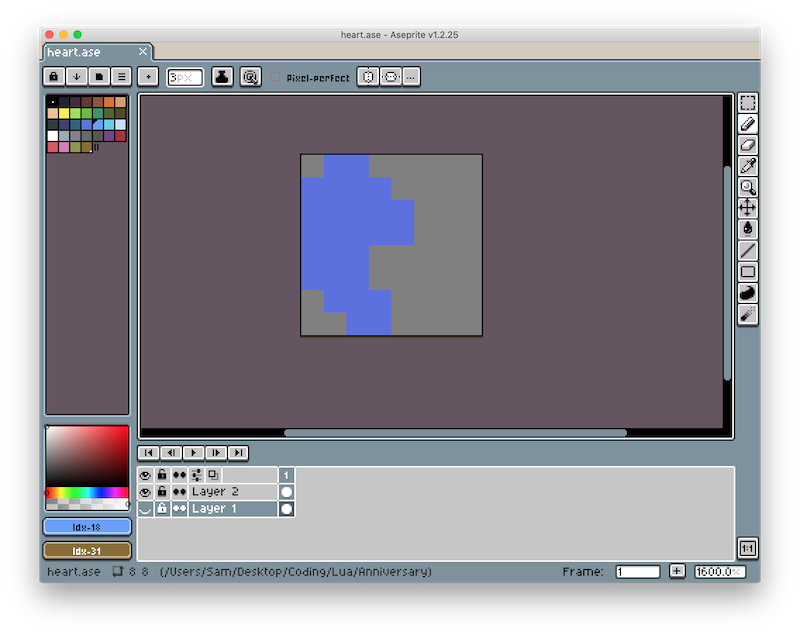
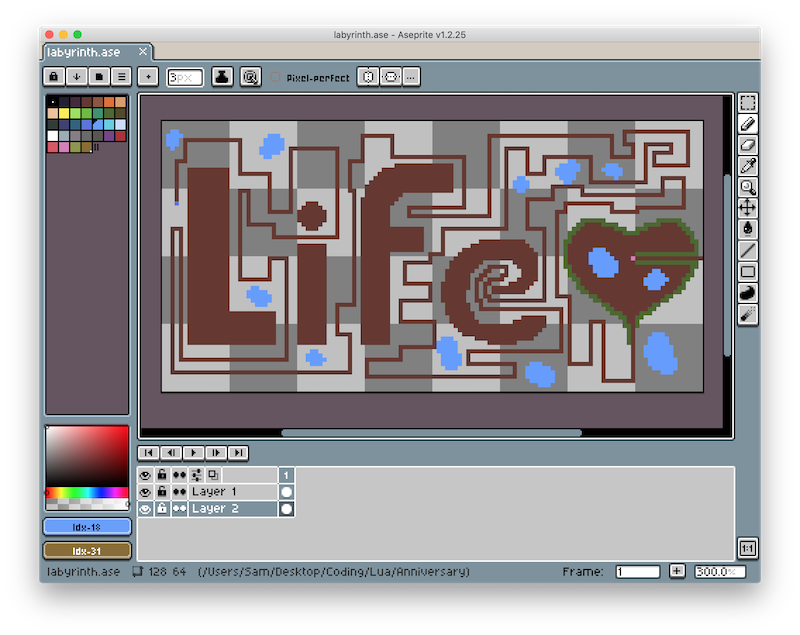
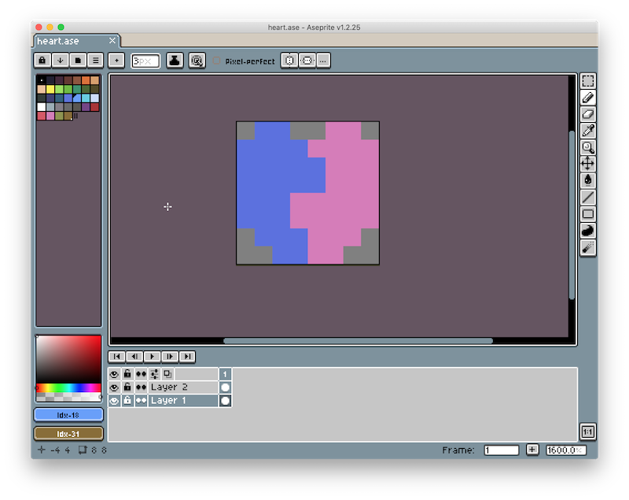

+++
title = "Game Day"

[extra]
stylesheets = ["/readable.css", "/blog.css"]
+++
## A-maze-ing Design

Last night, I thought more about the design of the game. I began this project with some vague ideas, but no concrete game mechanics or story. After working on the tileset yesterday, I realized doing the artwork for the game was the most time consuming task, and with only a couple days left to finish the game I would have to end up with a super simple product. I was inspired to try and make a maze that the player would wander through to find their missing half. I also decided, in the spirit of our anniversary, to change the character design so the player was half a heart and their goal was to search for their other half:



(My girlfriend thought it looked like a blob.)

I couldn't help making the game a little cheesey, and decided that the plot and level design should be used to tie into the ending cutscene. To help speed up gameplay and development (and allow for alliteration in the ending cuscene), I chose to make a labyrinth rather than a maze, so there was only one path the player could follow. This help me too, since I wouldn't need to design branching paths and dead ends, or balance the complexity of the maze. This was the design I ended up creating:



## Level Editor

Originially, the image of the labyrinth I designed was just meant to help me quickly picture the game world. However, after looking at the scale of the labyrinth (each pixel represents a tile from my spritesheet), I realized it would be nearly impossible to build the level in code with my deadline (not to mention the difficulty of changing the design later). With my knowledge of `Quads`, I decided to design the `world` object to automatically generate the game world given an input image.

I wrote a function that would check each pixel of the input image, compare it to a list of colors I defined in code, and assign a tile based on the color of the pixel.

```lua
-- world.lua
local r, g, b = input_image:getPixel(x, y)
if colors_equal(r, g, b, grass_rgb) then
	tiles[x][y] = love.graphics.newQuad(0, 0, 8, 8, terrain:getDimensions())
end
```

I also extended this system so the world automatically chose a random grass or wall tile to give the game world a more natural feel. I had to make a 2d table of `Quads` or tiles in `love.load()` to use since choosing a random `Quad` in `love.draw()` caused the world tiles to change every frame.

While this took a lot of code to get working, it allowed me to effectively use Aesprite as a level editor, which really helped me finalize the design of the labyrinth after playtesting the game.

## Lights, Camera, Action

With level generation working, to explore the generated labyrinth in-game, I needed to implement a basic camera. LÖVE doesn't have a built-in camera, so I followed a set of [camera tutorials](https://ebens.me/post/cameras-in-love2d-part-1-the-basics).

While workong on the camera, I discovered a bug with my terrain generation code. After figuring out how to zoom out the camera, I saw that the last column and row of my terrain image was not generating. After a little debugging, I learned that tables in Lua start indexing at 1 rather than 0, resulting in off-by-one errors scattered throughout my level generation code. Luckily, these weren't too difficult to fix.

After fixing those errors and some trial and error with the camera, I figured out how to translate and scale the camera using graphics transformations, and programmed it to center on and follow the player as they move around the world. To center the camera on the player, I used the following code:

```lua
-- camera.lua
love.graphics.translate(-camera.position.x + love.graphics.getWidth() / 2 * camera.scale.x, -camera.position.y + love.graphics.getHeight() / 2 * camera.scale.y)
```

## (Not) Smooth Moves

My next task was to tackle the movement mechanics. I wanted the player to stay on the tile grid rather than having smooth movement. Choosing this approach both helped setup the ending scene and drastically reduced the remaining work on the project. I wouldn't need to learn collision, and could instead limit the player's movements based on what tile they were trying to move to.

## Cutscene

With the terrain generation, camera, and movement working, I was nearing the end of the gameplay section of the project. To finish of the day's work, I started coding the ending cutscene.

First, I set the window's background color to match my plain grass color as a quick and dirty way to extend the world around the player.

Sadely, with very little time left to work on the project, my ending cutscene code was not as modular as I would have liked (spaghetti, anyone?). I added some code to the `love.update(dt)` to stop player control and begin applying transforms on the camera when they reach their missing half. Then I created some simple text objects to display (with time delays between them).

```lua
-- main.lua
local font = love.graphics.getFont()
local cutscene_text = love.graphics.newText(font, "Happy anniversary")
```

Finally, I ended the day by animating the two heart halves leaving the labyrinth together.


