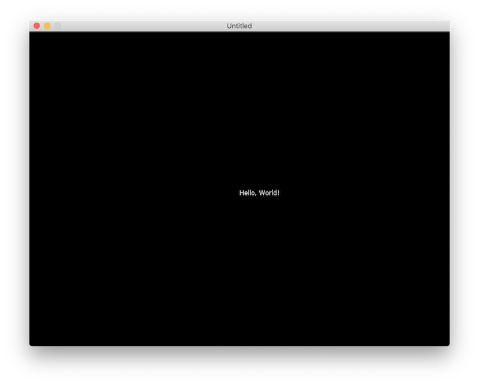
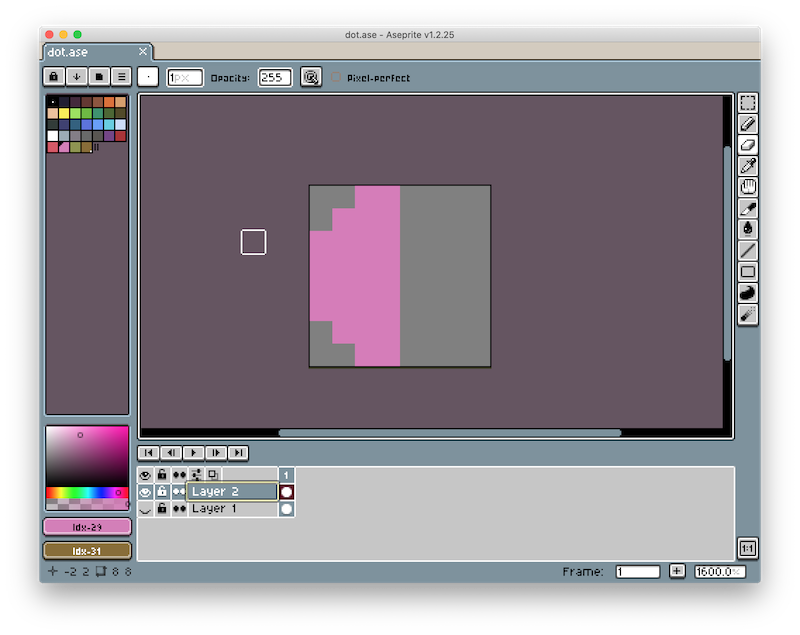
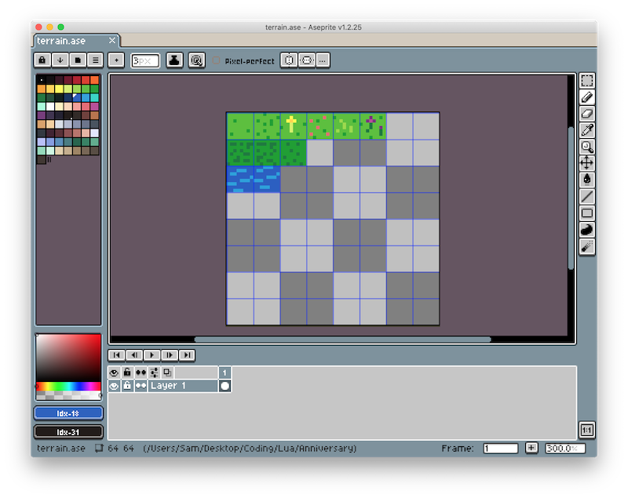

+++
title = "Learning to LÖVE"

[extra]
stylesheets = ["/readable.css", "/blog.css"]
+++
## Background

With my girlfriend and I's one year anniversary coming up soon, I thought it would be a fun opportunity to make a short game for her. I love pixel art (unlike my **objectively** wrong girlfriend), and while I'm not very good at making it, I thought designing a tileset for the game could be great practice. Next, I had to decide what engine to use to make the game. I had some experience with Unity, but a few weeks ago, I learned about the [LÖVE](https://love2d.org) game engine.

LÖVE is a framework for making 2d games in Lua. With only a few days ahead of me to make the project, I was worried about finishing it in time. While I already knew how to use Unity, it seemed like a lot of overhead and extra setup for such a small project. LÖVE, on the other hand appeared quick to prototype with, and being dedicated to 2d game development, seemed much more convenient to use.

I had to consider the benefits of using a familiar engine that I knew would take a decent amount of work vs. learning a new game engine which might eventually allow for quicker development. I decided to dive into LÖVE, and chose to name my game *Anniversary*. I figured a small project like Anniversary would be a great opportunity to dip my toe into the waters of LÖVE and try out the engine without committing to a larger-scale project.

## 0th Step

When working on coding projects, I like to create Docker containers to help manage different system install requirements, enhance the portability of my code, and reduce system debugging issues. Unfortunately, I have not yet figured out how to connect a Docker container application to my host computer's graphical display (definitely something I want to explore in the future). For this reason, I decided not to make a container for this project.

Another part of my workflow is to create a `do.sh` script containing a bunch of important commands and build flows so I don't have to remember or look up common actions.

## Hello, World

The first step of my journey was to get LÖVE installed and working. I followed the ["Getting Started" guide](https://love2d.org/wiki/Getting_Started) and created a `main.lua` file.

```lua
-- main.lua
function love.draw()
	love.graphics.print("Hello, world!", 400, 300)
end
```

I then ran my game by typing `open -n -a love .` and was excited to see my super-exciting-definitely-original-game up and running in just a few minutes:



## Smart Debugging: `print()`

Being new to LÖVE, and completely underestimating my familiarity with Lua (I had used it a bit when messing with the [ComputerCraft](http://www.computercraft.info) Minecraft mod many years ago), I decided it would be important to figure out how to print debugging information to the console.

This took a bit of trial and error, but eventually I figured out that I had to launch my game using the direct path to the `love.app` application instead of using the macOS `open` command. During the process, however, I learned more about how to build a `.love` file and package an executable. I updated my `do.sh` script with these build paths, as they might be useful in the future.

## Basic Player

The next step was to create a player sprite and figure out how to move them around the game window. For pixel art, I recently purchased [Aesprite](https://www.aseprite.org), which is a wonderful drawing application dedicated to pixel art. While $20 seemed like a small price to pay to kickstart *very professional pixel artist career*, they also have a [GitHub page](https://github.com/aseprite/aseprite/) with instructions on how to compile the application yourself for free.

Still being new to pixel art and under a time crunch (who knows what would happen if I didn't finish the game in time for our anniversary 😱), I decided to go with 8x8 pixel tiles for the player and tileset. These would allow me to quickly make (hopefully) passable art for the game. At this point, I had very little idea of what the game would be. Originially, I was going to make the player a simple 8x8 dot, but this design reminded me of a game I played a few months back called [Journey of the Broken Circle](https://store.steampowered.com/app/1179620/Journey_of_the_Broken_Circle/). I love the cartoonish-yet-romanic idea of a shape looking for its other piece.

Thus, I decided to make the player half a circle and have them search for their other half. I blocked out a simple player character:



Using the following code, I was able to get the sprite to draw on screen (though there was no scaling so it was very tiny):

```lua
-- player.lua
local sprite = nil

function love.load()
	sprite = love.graphics.newImage("player.png")
end

function love.draw()
	love.graphics.draw(sprite, 400, 300)
end
```

Since I was working with very low-resolution pixel art, I needed to figure out how to scale up the sprites in LÖVE without generating blurring artifacts. I learned (after more confusion than I would like to admit about `object:method()` syntax in Lua replacing `object.method()` on other C-based languages and enums in Lua, unlike in Swift or Python are just strings), that I could set a filter on the image's `Texture` object to adjust how it was scaled up and down.

```lua
-- player.lua
function love.load()
	sprite = love.graphics.newImage("player.png")
	sprite:setFilter("nearest", "nearest")
end
```

To actually scale up the sprite, I had to set the scale values when calling the draw function:

```lua
-- player.lua
local scale = 5

function love.draw()
	love.graphics.draw(sprite, 400, 300, 0, scale, scale)
end
```

## Classic Lua

When working with Unity, I primarily relied on classes and inheritance to contruct objects. I was surprised to learn that Lua, being a very lightweight scripting language, does not include native support for classes (or a bunch of other common data structures like arrays or hash tables). Lua's approach is to provide a `table` data structure, which can then be used as an array, dictionary, set, and many other common data structures depending on how the programmer uses it. Thus, I was forced to rethink my traditional design pattern.

It took me awhile to figure out a design pattern I was happy with (and I'm still not sure if I'm completely happy with it, but it was fine for this small project). I chose to follow a factor design pattern, and created a `player_factory` module with a single function called `newPlayer()`. This function initialized a `player` table object, and assigned it instance methods. I then followed the same approach for creating a `player_controller` object to connect user inputs to player actions.

## Basic Terrain

I decided to wrap up progress for the day by designing a simple tileset and hopefully getting some tiles drawn to the screen. This is the tileset I whipped up:



I wrote out a `world_factory` module to generate the `world` object and began figuring out how to divide my spritesheet into individual tile images in LÖVE. I figured out the tool I needed were `Quads`. I was then able to draw the selected portion of the spritesheet to the screen using a `draw()` call.

```lua
-- world.lua
local terrain = nil
local tile = nil

function love.load()
	terrain = love.graphics.newImage("terrain.png")
	tile = love.graphics.newQuad(0, 0, 8, 8, terrain:getDimensions())
end

function love.draw()
	love.graphics.draw(terrain, tile, 400, 300)
end
```

I was happy to see that the terrain was drawn to the screen, but I ran into an issue where the terrain was drawn over the player. It turns out LÖVE does not support sprite z positions, so I need to make sure I carefully manage the draw order by drawing the player after drawing the world.

## Wrap Up

With that, I had some new knowledge of Lua and LÖVE, the ability to control a player and render tiles from a spritesheet, and was excited to continue working on my game another day!
