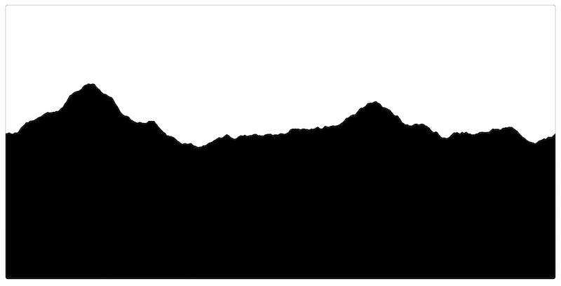
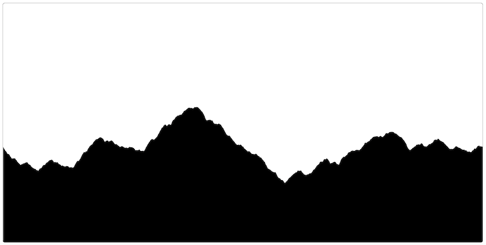

+++
title = "Rough Around the Edges"

[extra]
stylesheets = ["/readable.css", "/blog.css"]
+++
## Fractals All Around

Yes, that's a Frozen reference ❄️. While reading about different kinds of noise, I learned about a couple different options I could implement to achieve landscape-like images. The first was to add multiple [octaves](https://en.wikipedia.org/wiki/Octave_(electronics)) of Perlin noise to achieve rougher textures, creating a form of [fractal noise](https://en.wikipedia.org/wiki/Pink_noise). Other options were to use [value noise](https://en.wikipedia.org/wiki/Value_noise) or [Simplex noise](https://en.wikipedia.org/wiki/Simplex_noise) instead of Perlin noise. I chose to implement the fractal noise first to see what the results would look like.

So at this point you're probably wondering "What the heck does fractal noise mean? How to octaves play into that? Where are the pretty pictures??". Basically, for each octave, the frequency we pass into our `perlin()` function is doubled and the amplitude of the result is halved. Luckily this requires zero changes to our originial Perlin noise generator, and we just have to add a wrapper function to generate Perlin nose for each octave and sum across all the values.

```javascript
// mountains.js
function fractal(octaves, wavelength, gradients) {
	let noise = perlin(wavelength)

	for (let i = 1; i < octaves; i++) {
		const factor = Math.pow(2, i)
		const octaveNoise = perlin(wavelength / factor)
		noise = noise.map((height, index) => height + octaveNoise[index] / factor)
	}

	return noise
}
```

Because each octave results in larger gradient arrays and smaller amplitudes, the more octaves I use the rougher the terrain generated. I found that 8 octaves produced some nice rocky terrain.

## Scaling the Mountain

The values this new `fractal()` returns an array of noise with generally very small values, which I think scale later for plotting on my graph.

```javascript
// mountains.js
function scaleY(y, scale, shift) {
	return (y + 1) * scale + shift
}
```

After getting the fractal noise working, I adjusted `scale` and `shift` values so they are both relative to the height of the canvas. I also adjusted the way the values were calculated to depend on easily understandable changes.

```javascript
// mountains.js
const flatnessFactor = 2 // Larger is flatter
const scale = height / flatnessFactor
const heightSum = heights.reduce((first, second) => first + second) + heights.length
const averageHeight =  heightSum / heights.length * scale
const heightFactor = 0.5 // Between 0 and 1, represents where the average height of the noise will be relative to the height
const shift = (-height * heightFactor) + averageHeight
```

This system will make it easy for me to adjust the verticality and position of the mountains.

The result were actual mountain-y looking mountains 🏔️!



## Blooper Reel

While working on this new algorithm, I accidentally implemented it improperly (by generating a larger gradients array once and using that for all octaves) and produced some very fractal-y looking mountains.



Honestly though, I was really happy with how the fractal noise turned out and wanted to try move forward with making some artworks before adding in the erosion system (who knows, maybe it won't be necessary?).
