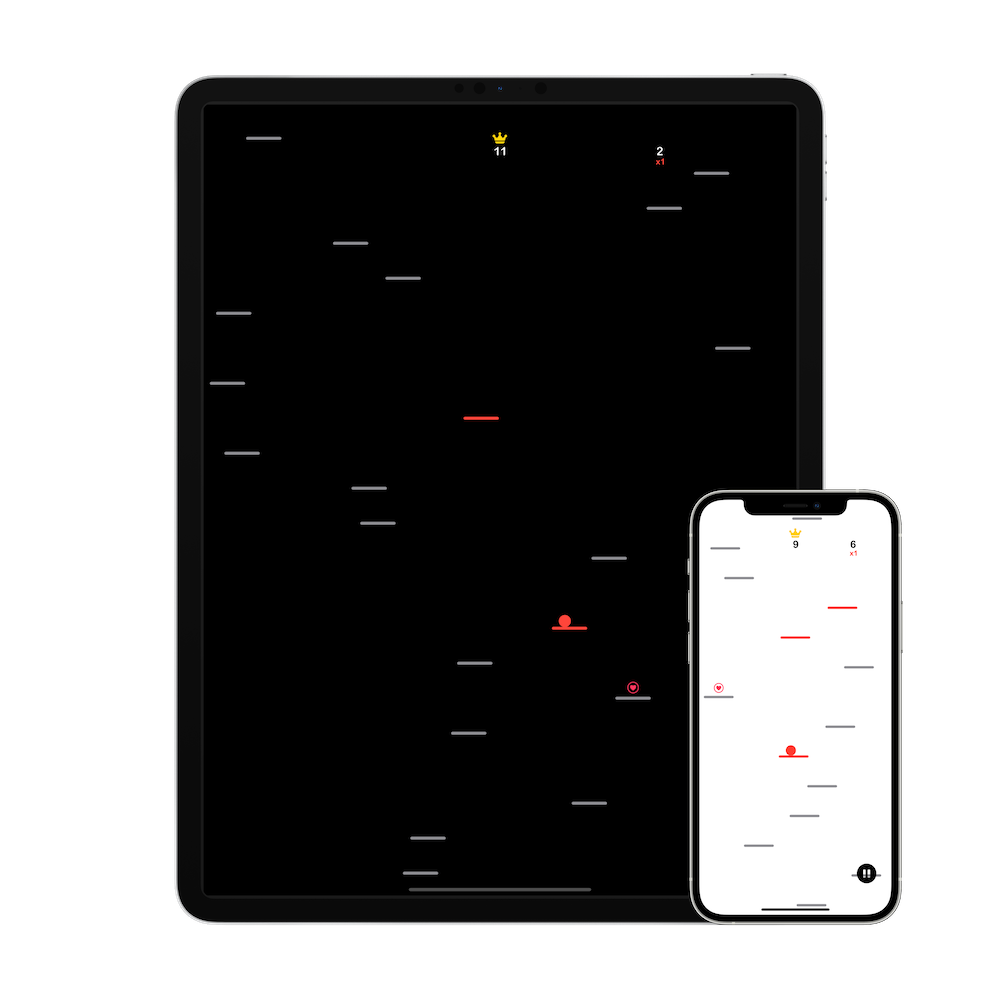

+++
title = "Fally Bally"

[extra]
stylesheets = ["/readable.css", "/app.css"]
+++
Fally Bally is a fun, minimalistic arcade game where you fall down an endless series of platforms and the more you land on, the better.

Tap left and right to move the ball, collect lives, increase your score multiplier, and touch as many platforms as you can to get the highest score! The game supports both light and dark mode and adjusts visuals automatically.

After more than six years, Fally Bally is back and looking better than ever!

[{{ light_dark_picture(light="/app-store-light.svg", dark="/app-store-dark.svg") }}](https://apps.apple.com/us/app/fally-bally/id1549562790)

For information on how to file a bug report or feature request, check out the Fally Bally [discussions](https://github.com/Sammcb/FallyBally/discussions/1).

## [Privacy Policy 🔗](#privacy){#privacy}

Fally Bally never collects or stores any personal data.
