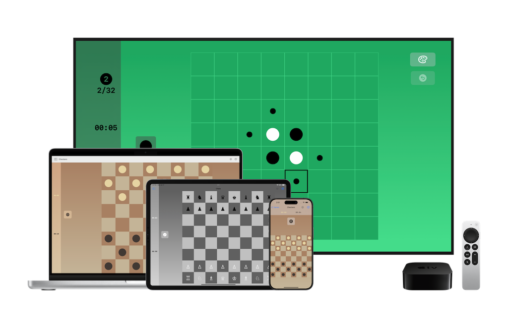

+++
title = "Gradient Games"

[extra]
stylesheets = ["/readable.css", "/app.css"]
+++
Gradient Games is a simple, colorful board game collection where you can create and share themes! Challenge friends to local games on the same device.

[{{ light_dark_picture(light="/app-store-light.svg", dark="/app-store-dark.svg") }}](https://apps.apple.com/us/app/gradient-games/id1609975604)

For information on how to file a bug report or feature request, check out the Gradient Games [discussions](https://github.com/Sammcb/GradientGames/discussions/1). To get started, here are a few fun themes for each game! These can be imported into the app in the settings menu.

{{ download_link(file="starter_themes.json", label="Download 🌊 🌲 🌑 🍁 ❄️ 🌸 ☀️ themes!") }}

## [Privacy Policy 🔗](#privacy){#privacy}

Gradient Games never collects or stores any personal data.
